<h2>TensorFlow-FlexUNet-Image-Segmentation-Brain-Intracranial-Hemorrhage (2026/01/20)</h2>
Sarah T. Arai 
Software Laboratory antillia.com  
This is the first experiment of Image Segmentation for <b>Brain-Intracranial-Hemorrhage</b>  
based on our <a href="./src/TensorFlowFlexUNet.py">TensorFlowFlexUNet</a> (TensorFlow Flexible UNet Image Segmentation Model for Multiclass) , 
and a 650x650 pixels <a href="https://drive.google.com/file/d/1RSJdvUMjQD4cLA0fk0KfKe3M5kg8qO27/view?usp=sharing">
<b>Augmented-Brain-Intracranial-Hemorrhage-ImageMask-Dataset.zip</b></a>, which was derived by us from
<a href="https://www.kaggle.com/datasets/vbookshelf/computed-tomography-ct-images/data">
<b>Brain CT Images with Intracranial Hemorrhage Masks.</b>
</a>
  
<b>Data Augmentation Strategy</b> 
To address the limited size of images and masks of the original 
<a href="https://www.kaggle.com/datasets/vbookshelf/computed-tomography-ct-images/data">
<b>Brain CT Images with Intracranial Hemorrhage Masks</b></a>,
we used our offline augmentation tool 
<a href="./generator/ImageMaskDatasetGenerator.py"> 
ImageMaskDatasetGenerator.py</a> 
to generate the Augmented dataset from  the original dataset.
   

<b>Actual Image Segmentation for Brain-Intracranial-Hemorrhage Images of 650x650 pixels</b> 
As shown below, the inferred masks look similar to the ground truth masks.   
 
<table>
<tr>
<th>Input: image</th>
<th>Mask (ground_truth)</th>
<th>Prediction: inferred_mask</th>
</tr>
<tr>
<td>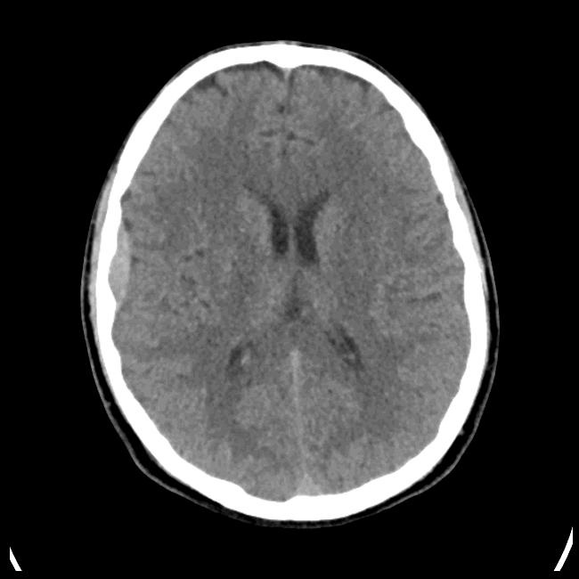</td>
<td></td>
<td></td>
</tr>

<tr>
<td>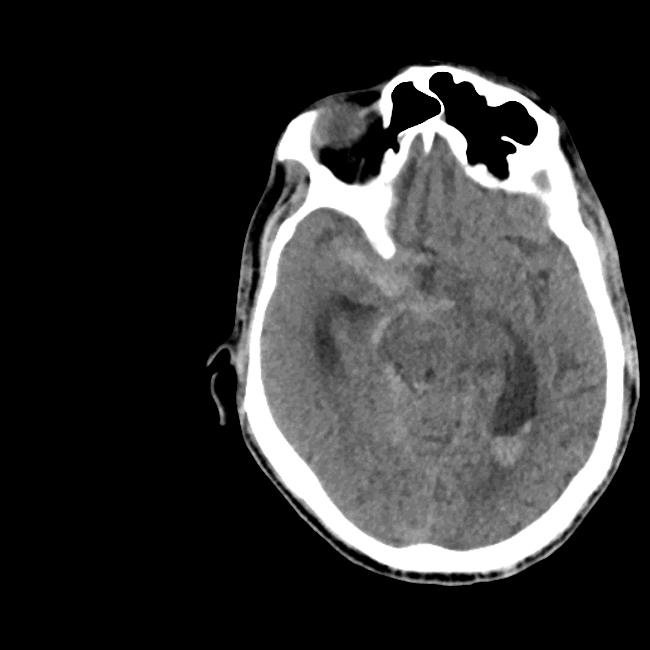</td>
<td></td>
<td></td>
</tr>

<tr>
<td>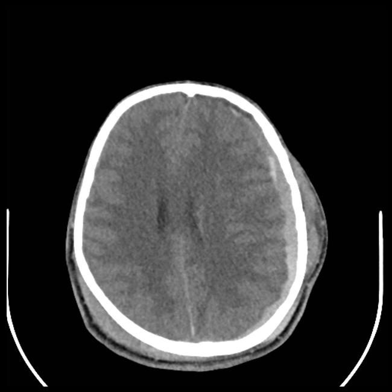</td>
<td></td>
<td></td>
</tr>
</table>

 
<h3>1  Dataset Citation</h3>
The dataset used here was derived from:  
<a href="https://www.kaggle.com/datasets/vbookshelf/computed-tomography-ct-images/data">
<b>Brain CT Images with Intracranial Hemorrhage Masks.</b>
</a>
 
for Intracranial Hemorrhage Detection and Segmentation
  
<b>About Dataset</b> 
<b>Context</b> 
<i>
Intracranial hemorrhage, bleeding that occurs inside the cranium, is a serious health problem requiring rapid and often intensive medical treatment. For example, intracranial hemorrhages account for approximately 10% of strokes in the U.S., where stroke is the fifth-leading cause of death. Identifying the location and type of any hemorrhage present is a critical step in treating the patient.
Diagnosis requires an urgent procedure. When a patient shows acute neurological symptoms such as severe headache or loss of consciousness, highly trained specialists review medical images of the patient’s cranium to look for the presence, location and type of hemorrhage. The process is complicated and often time consuming.
  
</i>
~ Quote from the Kaggle RSNA Intracranial Hemorrhage Detection Competition overview.  
<b>Content</b> 
This dataset consists of head CT (Computed Thomography) images in jpg format. There are 2500 brain window images and 2500 bone window images, 
 
for 82 patients. There are approximately 30 image slices per patient. 318 images have associated intracranial image masks. 
Also included are csv files containing hemorrhage diagnosis data and patient data.
This is version 1.0.0 of this dataset. A full description of this dataset as well as updated versions can be found here:
<a href="https://physionet.org/content/ct-ich/view-license/1.0.0/">https://physionet.org/content/ct-ich/view-license/1.0.0/</a>
  
<b>Citation</b> 
Hssayeni, M. (2019). Computed Tomography Images for Intracranial Hemorrhage Detection and Segmentation.  
PhysioNet. doi:10.13026/w8q8-ky94
  
<b>License</b> 
Creative Commons Attribution 4.0 International Public Licence 
<a href="https://physionet.org/content/ct-ich/view-license/1.0.0/">https://physionet.org/content/ct-ich/view-license/1.0.0/</a>
 
 
<h3>
2 Brain-Intracranial-Hemorrhage ImageMask Dataset
</h3>
 If you would like to train this Brain-Intracranial-Hemorrhage Segmentation model by yourself,
 please download the original dataset from the google drive  
<a href="https://drive.google.com/file/d/1RSJdvUMjQD4cLA0fk0KfKe3M5kg8qO27/view?usp=sharing">
<b>Augmented-Brain-Intracranial-Hemorrhage-ImageMask-Dataset.zip</b></a>
, expand the downloaded, and put it under <b>./dataset </b> folder to be: 
<pre>
./dataset
└─Brain-Intracranial-Hemorrhage
    ├─test
    │   ├─images
    │   └─masks
    ├─train
    │   ├─images
    │   └─masks
    └─valid
        ├─images
        └─masks
</pre>
 
<b>Brain-Intracranial-Hemorrhage Statistics</b> 
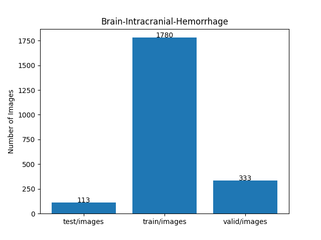 
 
As shown above, the number of images of train and valid datasets is not enough to use for a training set of our segmentation model.
 
 
<b>Train_images_sample</b> 
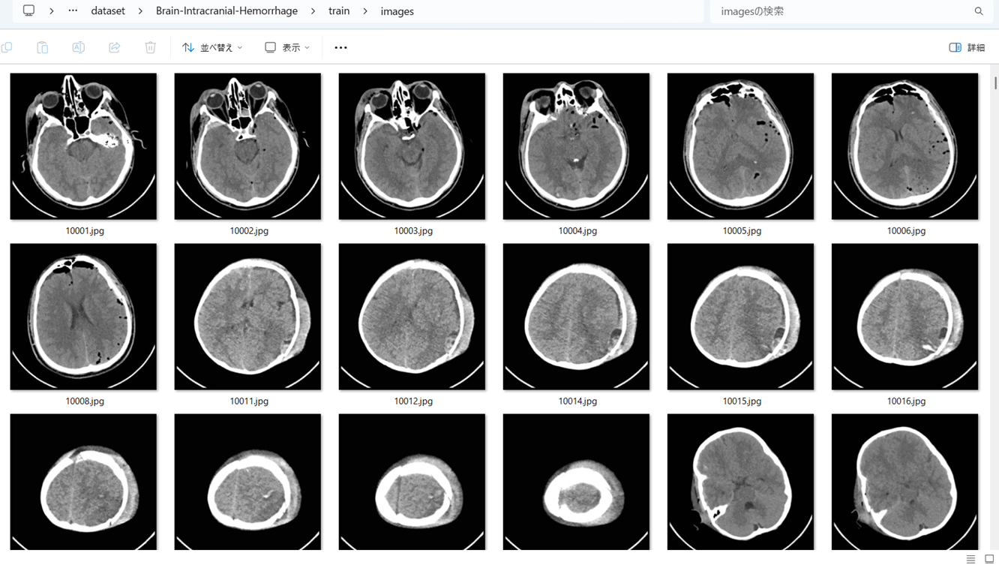
 
<b>Train_masks_sample</b> 
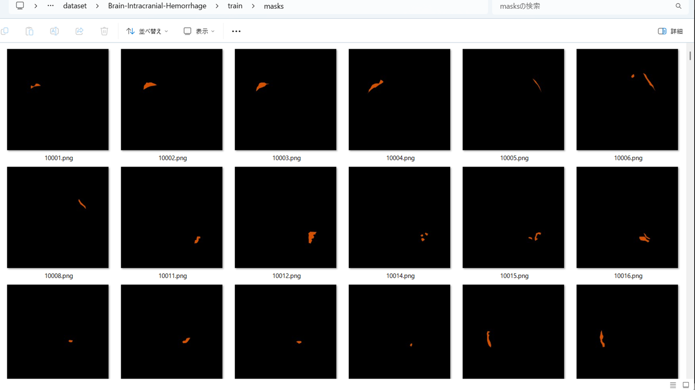
 
<h3>
3 Train TensorflowFlexUNet Model
</h3>
 We trained Brain-Intracranial-Hemorrhage TensorflowFlexUNet Model by using the following
<a href="./projects/TensorFlowFlexUNet/Brain-Intracranial-Hemorrhage/train_eval_infer.config"> <b>train_eval_infer.config</b></a> file.  
Please move to ./projects/TensorFlowFlexUNet/Brain-Intracranial-Hemorrhage and run the following bat file. 
<pre>
>1.train.bat
</pre>
, which simply runs the following command. 
<pre>
>python ../../../src/TensorFlowFlexUNetTrainer.py ./train_eval_infer.config
</pre>

<b>Model parameters</b> 
Defined a small <b>base_filters=16</b> and a large <b>base_kernels=(11,11)</b> for the first Conv Layer of Encoder Block of 
<a href="./src/TensorFlowFlexUNet.py">TensorFlowFlexUNet.py</a> 
and a large num_layers (including a bridge between Encoder and Decoder Blocks).
<pre>
[model]
image_width    = 512
image_height   = 512
image_channels = 3
input_normalize = True
normalization  = False

num_classes    = 2

base_filters   = 16
base_kernels   = (11,11)
num_layers     = 8

dropout_rate   = 0.04
dilation       = (1,1)
</pre>

<b>Learning rate</b> 
Defined a small learning rate.  
<pre>
[model]
learning_rate  = 0.00007
</pre>

<b>Loss and metrics functions</b> 
Specified "categorical_crossentropy" and "dice_coef_multiclass". 
<pre>
[model]
loss           = "categorical_crossentropy"
metrics        = ["dice_coef_multiclass"]
</pre>
<b >Learning rate reducer callback</b> 
Enabled learing_rate_reducer callback, and a small reducer_patience.
<pre> 
[train]
learning_rate_reducer = True
reducer_factor     = 0.5
reducer_patience   = 4
</pre>
<b>Early stopping callback</b> 
Enabled early stopping callback with patience parameter.
<pre>
[train]
patience      = 10
</pre>
<b></b> 
<b>RGB color map</b> 
rgb color map dict for Brain-Intracranial-Hemorrhage 1+1 classes. 
<pre>
[mask]
mask_file_format = ".png"
;Brain-Intracranial-Hemorrhage 1+1
;                   Hemorrhage: brown
rgb_map={(0,0,0):0, (210, 80, 0):1,}
</pre>
<b>Epoch change inference callbacks</b> 
Enabled epoch_change_infer callback. 
<pre>
[train]
epoch_change_infer       = True
epoch_change_infer_dir   =  "./epoch_change_infer"
epoch_changeinfer        = False
epoch_changeinfer_dir    = "./epoch_changeinfer"
num_infer_images         = 6
</pre>
By using this epoch_change_infer callback, on every epoch_change, the inference procedure can be called
 for 6 images in <b>mini_test</b> folder. This will help you confirm how the predicted mask changes 
 at each epoch during your training process.    
<b>Epoch_change_inference output at starting (1,2,3)</b> 
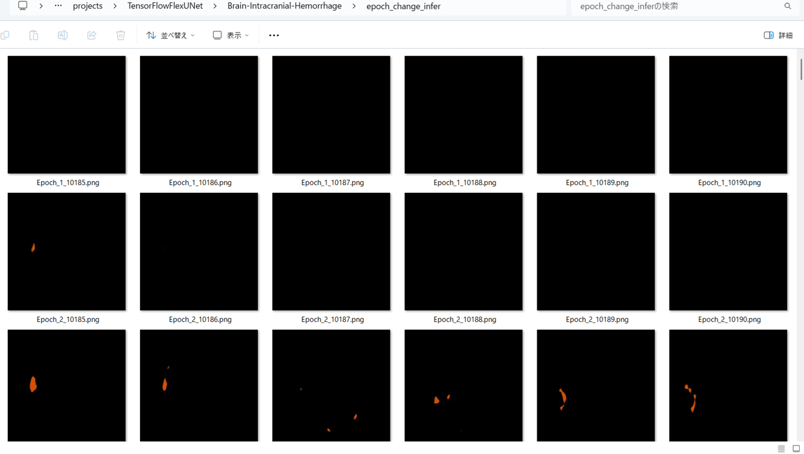 
 
<b>Epoch_change_inference output at ending (23,24,25)</b> 
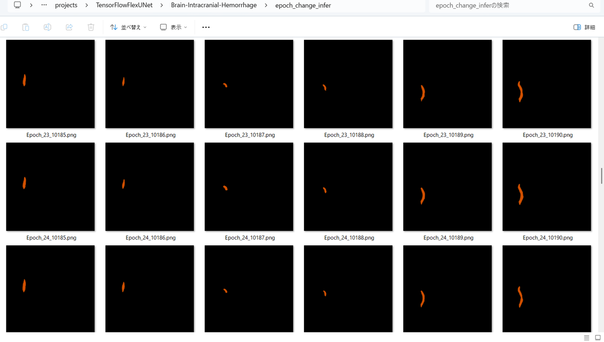 
 
<b>Epoch_change_inference output at ending (48,49,50)</b> 
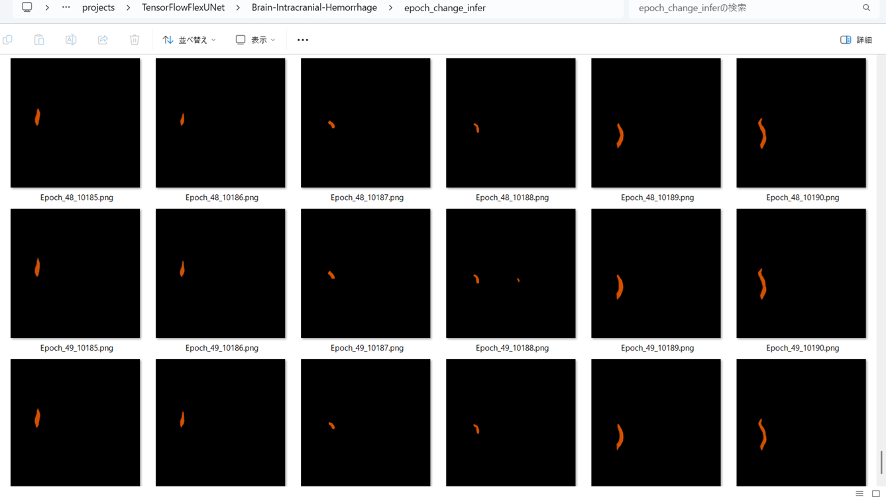 

 
In this experiment, the training process was terminated at epoch 50.  
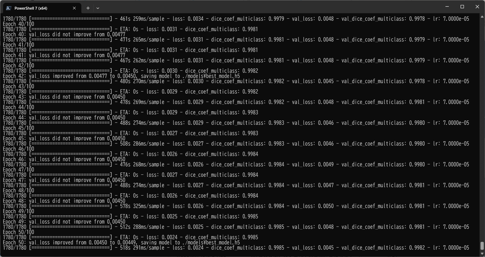 
 
<a href="./projects/TensorFlowFlexUNet/Brain-Intracranial-Hemorrhage/eval/train_metrics.csv">train_metrics.csv</a> 
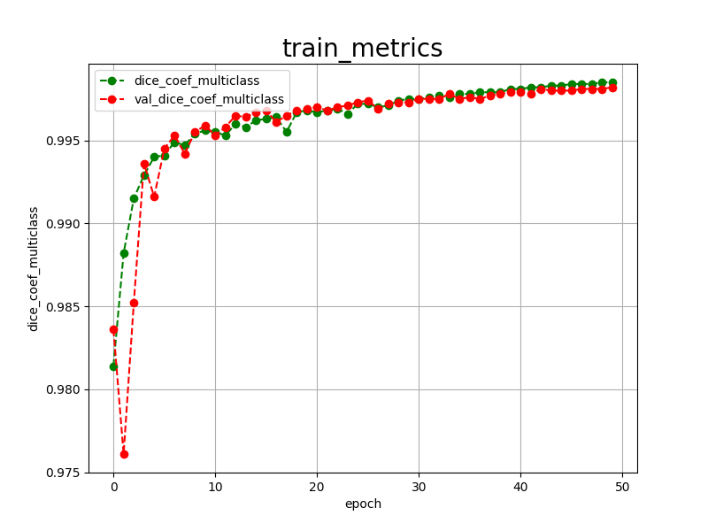 

 
<a href="./projects/TensorFlowFlexUNet/Brain-Intracranial-Hemorrhage/eval/train_losses.csv">train_losses.csv</a> 
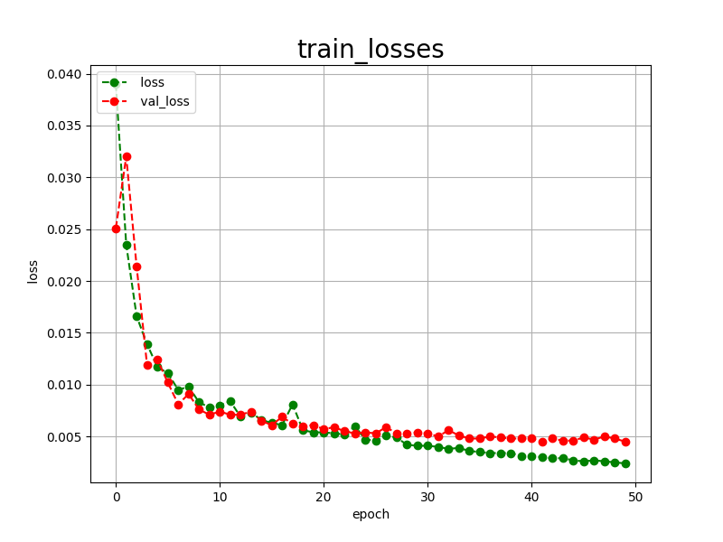 
 
<h3>
4 Evaluation
</h3>
Please move to a <b>./projects/TensorFlowFlexUNet/Brain-Intracranial-Hemorrhage</b> folder,
and run the following bat file to evaluate TensorflowFlexUNet model for Brain-Intracranial-Hemorrhage. 
<pre>
>./2.evaluate.bat
</pre>
This bat file simply runs the following command.
<pre>
>python ../../../src/TensorFlowFlexUNetEvaluator.py  ./train_eval_infer.config
</pre>
Evaluation console output: 
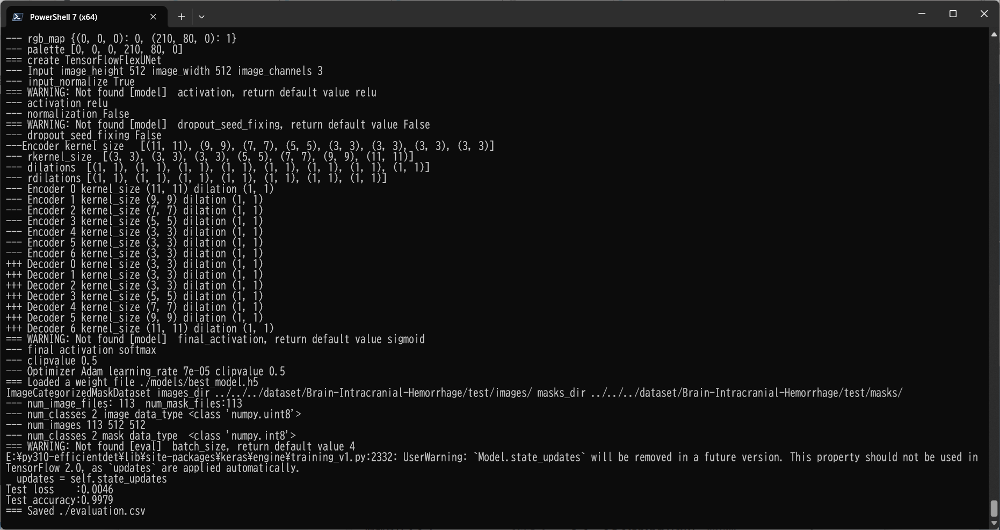
  Image-Segmentation-Brain-Intracranial-Hemorrhage
<a href="./projects/TensorFlowFlexUNet/Brain-Intracranial-Hemorrhage/evaluation.csv">evaluation.csv</a> 
The loss (categorical_crossentropy) to this Brain-Intracranial-Hemorrhage/test was very low, and dice_coef_multiclass very high as shown below.
 
<pre>
categorical_crossentropy,0.0046
dice_coef_multiclass,0.9979
</pre>
 
<h3>5 Inference</h3>
Please move to a <b>./projects/TensorFlowFlexUNet/Brain-Intracranial-Hemorrhage</b> folder 
,and run the following bat file to infer segmentation regions for images by the Trained-TensorflowFlexUNet model for Brain-Intracranial-Hemorrhage. 
<pre>
>./3.infer.bat
</pre>
This simply runs the following command.
<pre>
>python ../../../src/TensorFlowFlexUNetInferencer.py ./train_eval_infer.config
</pre>

<b>mini_test_images</b> 
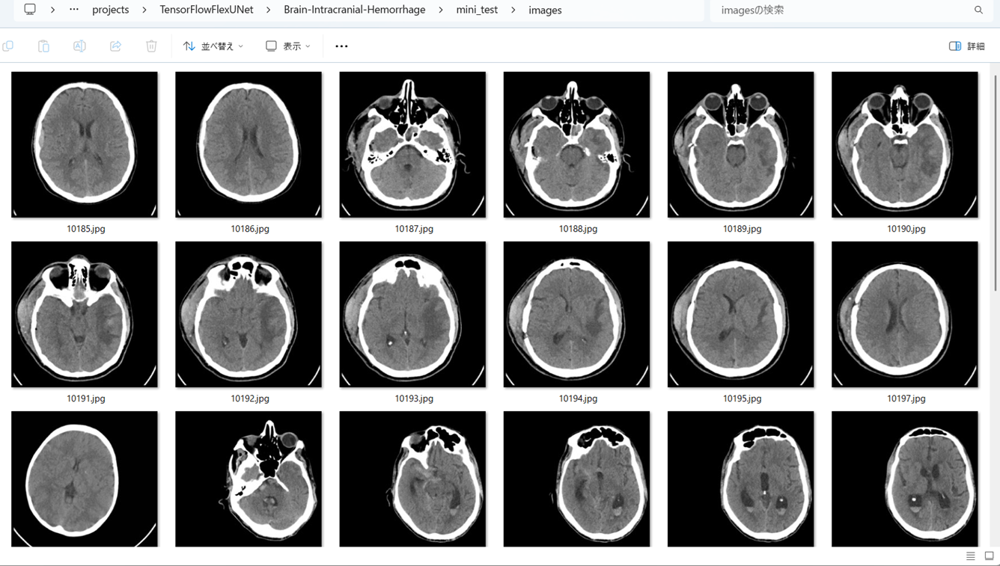 
<b>mini_test_mask(ground_truth)</b> 
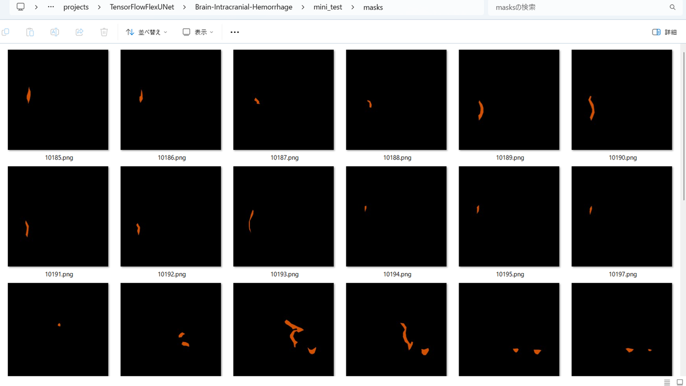 

<b>Inferred test masks</b> 
 
 

<b>Enlarged images and masks for Brain-Intracranial-Hemorrhage Images of 650x650 pixels</b> 
As shown below, the inferred masks predicted by our segmentation model trained on the dataset appear similar to the ground truth masks.
 
 
<table>
<tr>
<th>Input: image</th>
<th>Mask (ground_truth)</th>
<th>Prediction: inferred_mask</th>
</tr>
<tr>
<td>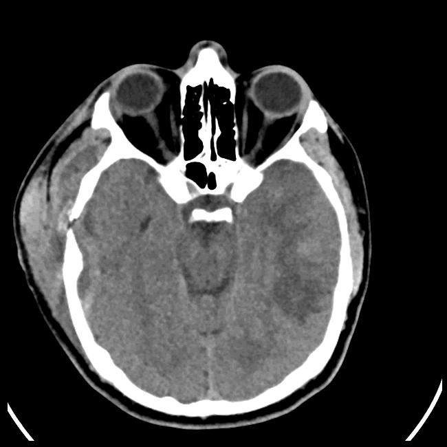</td>
<td></td>
<td></td>
</tr>

<tr>
<td>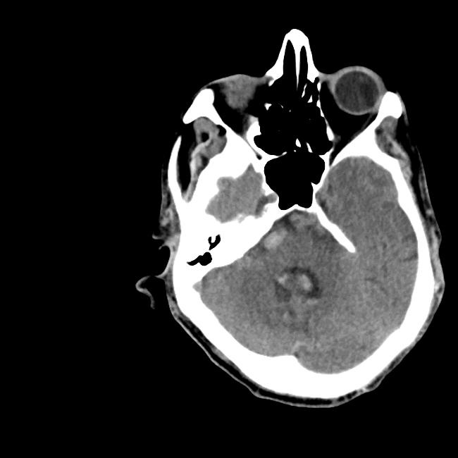</td>
<td></td>
<td></td>
</tr>

<tr>
<td></td>
<td></td>
<td></td>
</tr>
<tr>
<td>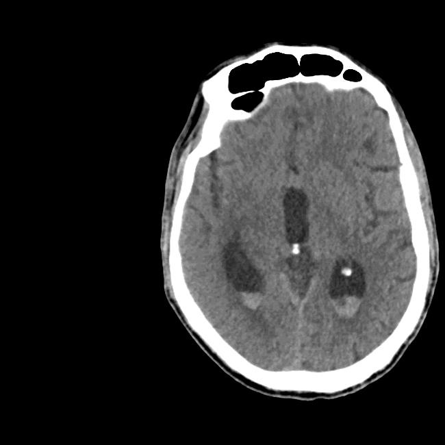</td>
<td></td>
<td></td>
</tr>
<tr>
<td></td>
<td></td>
<td></td>
</tr>
<tr>
<td>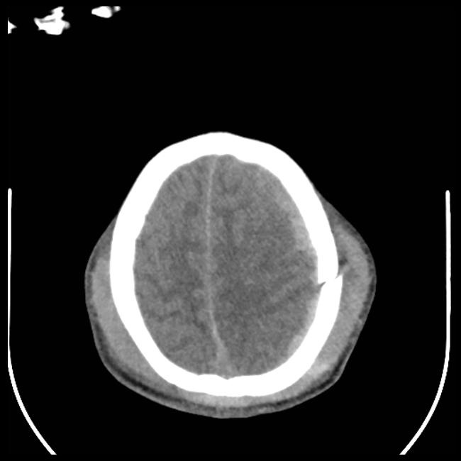</td>
<td></td>
<td></td>
</tr>
</table>

 
<h3>
References
</h3>
<b>1. BHSD: A 3D Multi-Class Brain Hemorrhage Segmentation Dataset</b> 
Biao Wu, Yutong Xie, Zeyu Zhang, Jinchao Ge, Kaspar Yaxley, Suzan Bahadir, Qi Wu, Yifan Liu, Minh-Son To 
<a href="https://arxiv.org/pdf/2308.11298">https://arxiv.org/pdf/2308.11298</a>
 
 
<b>2. Advanced multi-label brain hemorrhage segmentation using an attention-based residual U-Net model</b> 
Xinxin Lin, Enmiao Zou, Wenci Chen, Xinxin Chen, Le Lin 
<a href="https://bmcmedinformdecismak.biomedcentral.com/articles/10.1186/s12911-025-03131-3">
https://bmcmedinformdecismak.biomedcentral.com/articles/10.1186/s12911-025-03131-3</a>
 
 
<b>3. TensorFlow-FlexUNet-Image-Segmentation-Model</b> 
Toshiyuki Arai  
<a href="https://github.com/sarah-antillia/TensorFlow-FlexUNet-Image-Segmentation-Model">
https://github.com/sarah-antillia/TensorFlow-FlexUNet-Image-Segmentation-Model
</a>
 
 
